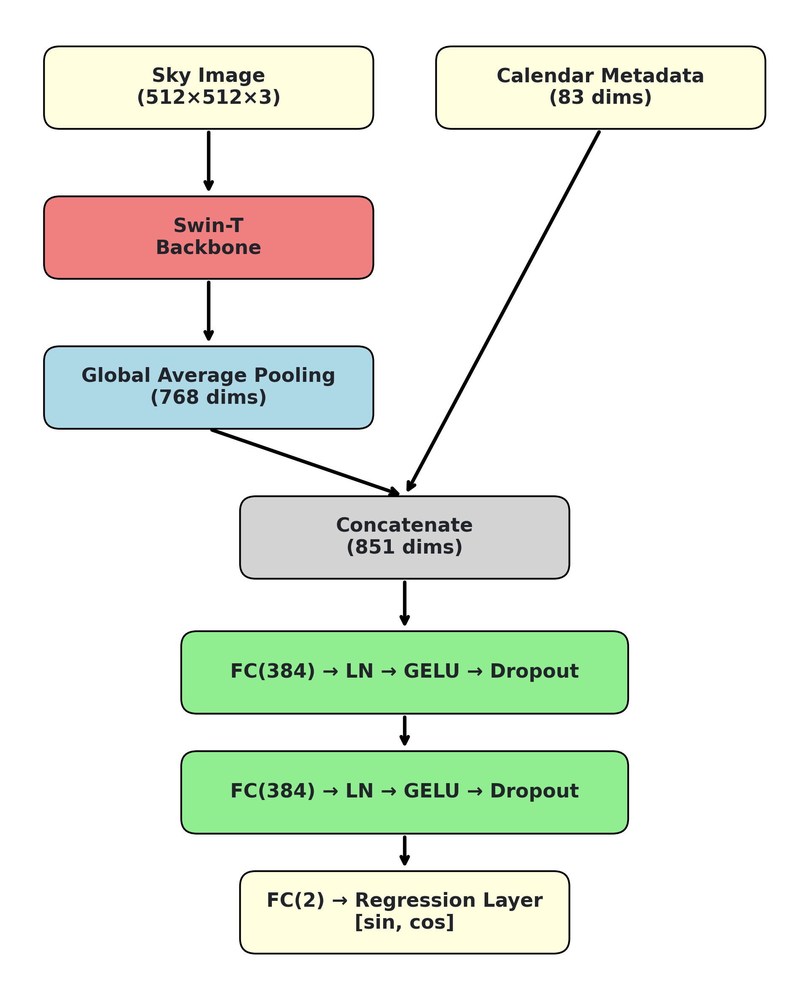
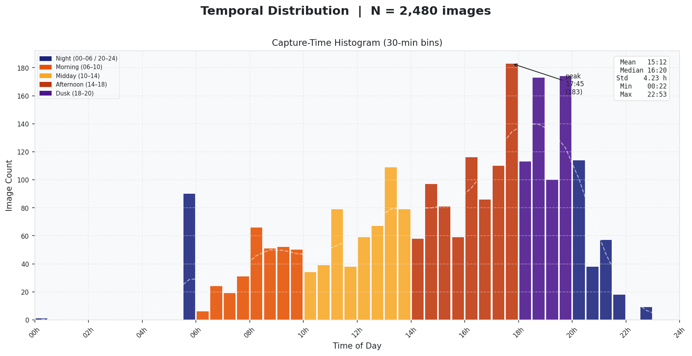
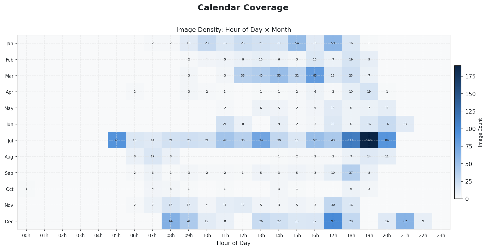
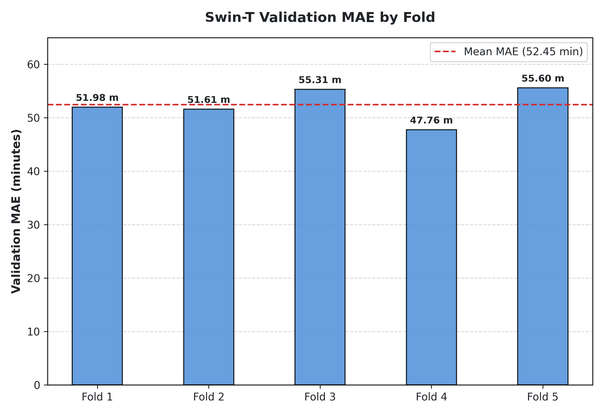
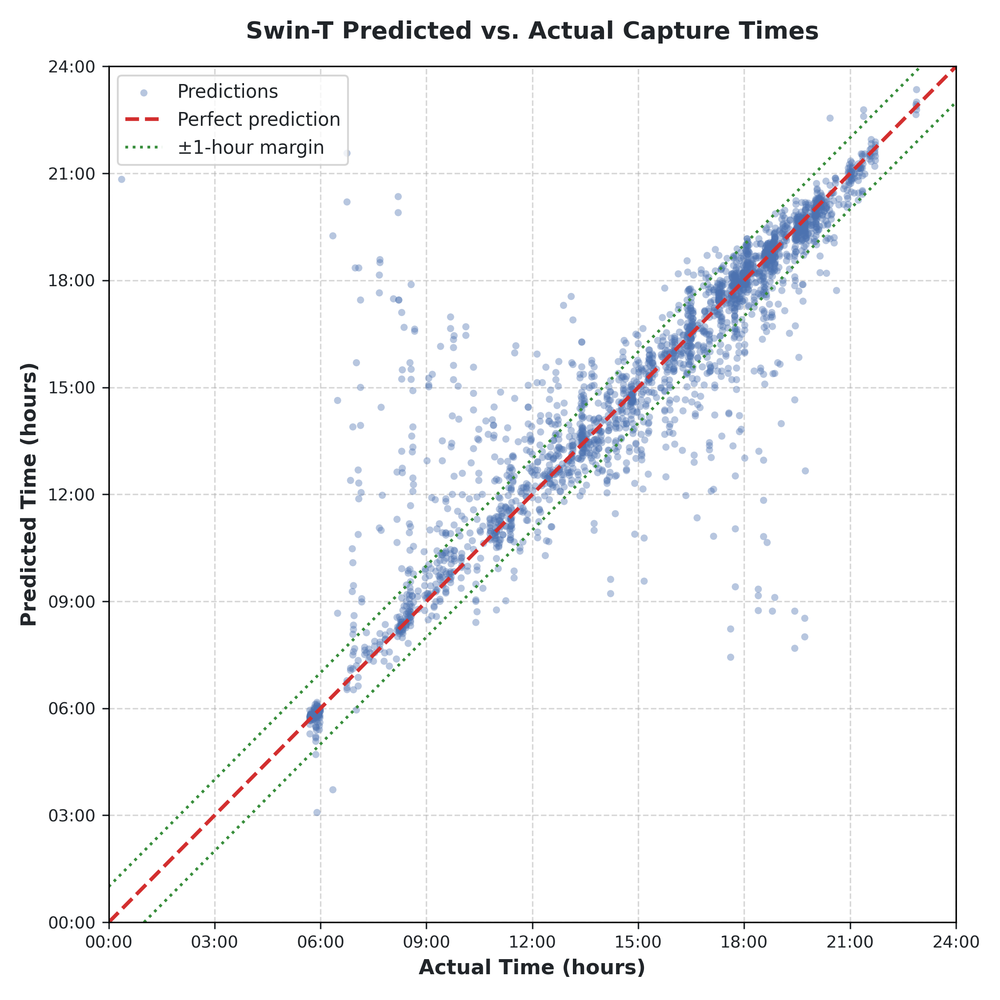
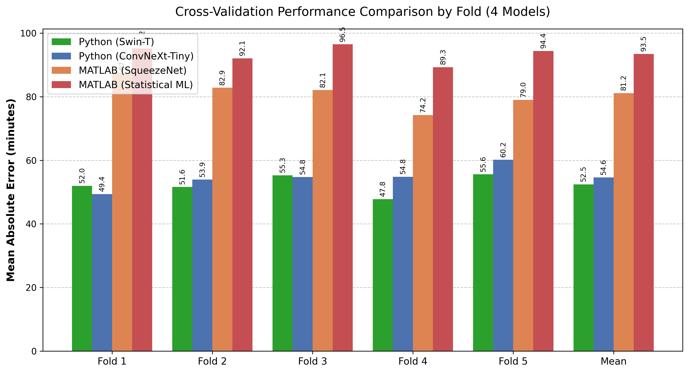
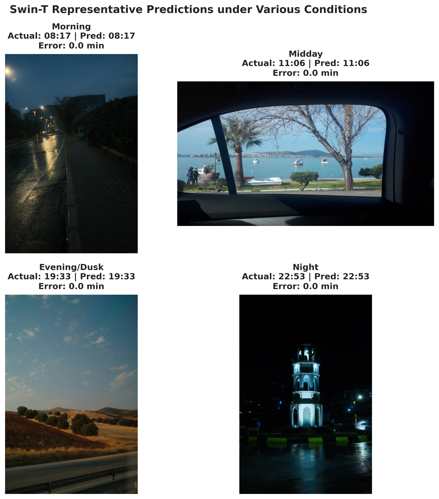

# Deep Learning-Based Time-of-Day Estimation from Sky Images and EXIF Calendar Dates

### Authors & Affiliation
- **Alkım Gönenç Efe**, **Sarp Sünbül**, **Damla Parlakyıldız**
- *Department of Computer Engineering, İzmir Katip Çelebi University, İzmir, Türkiye*

---

## 1. Abstract
Modern digital galleries often sort outdoor photos by time of day using basic brightness metrics, which leads to systematic misclassification under artificial lighting or heavy cloud cover. This paper presents a hybrid deep learning framework that estimates capture time from a single sky image by fusing visual features with cyclically encoded EXIF calendar metadata. The dataset consists of 2,483 consumer smartphone photographs collected under diverse conditions spanning dawn, midday, dusk, and artificial-light scenes. The proposed pipeline leverages a Swin Transformer (Swin-T) backbone paired with a metadata-fusion MLP operating on 77 handcrafted photometric descriptors. A cyclic sine–cosine target encoding models the circular topology of the 24-hour clock, eliminating discontinuities at the midnight boundary. The training pipeline incorporates Mixup augmentation, label noise injection, cosine annealing, and weighted sampling to handle temporal imbalance. Evaluated across five-fold cross-validation, the proposed Swin-T framework achieves a mean cyclic MAE of 52.45 minutes, demonstrating the value of fusing learned visual representations with calendar metadata for robust continuous time-of-day regression.

---

## 2. Key Contributions
1. **Hybrid Fusion Architecture**: Combines a deep vision backbone (Swin-T / ConvNeXt-Tiny) with a metadata-fusion Multi-Layer Perceptron (MLP) head integrating both learned deep features and 77 handcrafted photometric descriptors.
2. **Circular Topology Modeling**: Employs cyclic sine-cosine target and calendar encoding to eliminate discontinuities at the midnight (24-hour) and year (365.25 days) boundaries.
3. **Robust Optimization Pipeline**: Incorporates Mixup, label noise, cosine annealing, and weighted sampling to address dataset imbalance and avoid overfitting.
4. **Comprehensive Baseline Comparison**: Benchmarks the proposed Python pipeline against a MATLAB pipeline (using SqueezeNet) and a purely statistical machine learning ensemble (SVR, RF, GBT) operating on handcrafted features.

---

## 3. Methodology & System Architecture

### 3.1 Proposed Pipeline Architecture
The proposed architecture integrates deep learned features from the image with handcrafted photometric descriptors and cyclical EXIF metadata. 

*Figure 1: Proposed pipeline leveraging a Swin-T backbone combined with a metadata fusion MLP.*

The system processes a $512 \times 512$ sky image using a Swin Transformer (Swin-T) backbone, yielding a $768$-dimensional visual representation $\mathbf{f}_{\text{img}}$ after Global Average Pooling. The early stages (patch embedding and first two transformer stages) are frozen to retain generalizable pre-trained features, while the deeper stages are fine-tuned.

### 3.2 Feature Engineering
A total of **83 metadata features** are fused with the visual representation:
1. **Handcrafted Photometric Features ($77$ dimensions)**:
   - RGB, HSV, and normalized CIELAB channel statistics (mean and standard deviation) ($18$ dims)
   - RGB and HSV histograms ($8$ bins per channel) ($48$ dims)
   - Sky-region luminance (top third of the image frame) ($2$ dims)
   - Vertical luminance gradient ($1$ dim)
   - Color temperature proxy (R/B channel ratio) ($1$ dim)
   - Global luminance statistics (mean, standard deviation, and entropy) ($3$ dims)
   - Saturation statistics ($2$ dims)
   - Canny edge density ($1$ dim)
   - Laplacian variance for cloud texture representation ($1$ dim)
2. **Calendar Metadata Encoding ($6$ dimensions)**:
   To preserve the circular continuity of calendar dates and seasonal variations, the date and spatial metadata are cyclically encoded as:
   $$\mathbf{m}_{\text{cal}} = \begin{bmatrix} \sin\left(\frac{2\pi \cdot \text{month}}{12}\right) \\ \cos\left(\frac{2\pi \cdot \text{month}}{12}\right) \\ \sin\left(\frac{2\pi \cdot \text{doy}}{365.25}\right) \\ \cos\left(\frac{2\pi \cdot \text{doy}}{365.25}\right) \\ \frac{\text{lat}}{90} \\ \frac{\text{lon}}{180} \end{bmatrix}$$
   where $\text{doy}$ is the day of year ($1 \le \text{doy} \le 366$), and $\text{lat}, \text{lon}$ are normalized GPS coordinates.

Concatenating $\mathbf{f}_{\text{img}}$ ($768$ dims) and the metadata feature vector $\mathbf{m}$ ($83$ dims) yields an $851$-dimensional representation fed to a 3-layer MLP fusion head with hidden dimensions of $384$, GELU activations, Layer Normalization, and Dropout ($0.0293$).

### 3.3 Target Encoding
The target time of day is represented cyclicly as a 2D unit-circle coordinate to eliminate boundary issues at midnight:
$$\mathbf{y} = \begin{bmatrix} \sin\left(\frac{2\pi t}{1440}\right) \\ \cos\left(\frac{2\pi t}{1440}\right) \end{bmatrix}$$
where $t$ represents minutes since midnight ($t \in [0, 1440)$). 

To map prediction coordinates back into minutes since midnight, the decoding formula is:
$$\hat{t} = \frac{\text{atan2}(\hat{y}_{\sin}, \hat{y}_{\cos}) \pmod{2\pi}}{2\pi} \times 1440$$

### 3.4 Loss and Evaluation Metrics
- **Loss Function**: Mean Squared Error (MSE) on the 2D coordinates:
  $$\mathcal{L} = \frac{1}{N} \sum_{i=1}^{N} \left\| \hat{\mathbf{y}}_i - \mathbf{y}_i \right\|_2^2$$
- **Primary Metric**: Cyclic Mean Absolute Error ($\text{MAE}_{\text{cyc}}$) in minutes:
  $$\text{MAE}_{\text{cyc}} = \frac{1}{N} \sum_{i=1}^{N} \min\left(|\hat{t}_i - t_i|,\; 1440 - |\hat{t}_i - t_i|\right)$$

---

## 4. Dataset & Preprocessing
The dataset comprises **2,483 outdoor sky images** collected from personal smartphone galleries (representing JPEG, PNG, HEIC, and DNG raw formats) spanning the years 2023 to 2026. 

| Dataset Property | Description / Value |
| :--- | :--- |
| **Total Images** | 2,483 |
| **Supported Formats** | JPEG, HEIC, PNG, DNG |
| **Time Span** | 03:00 to 23:25 |
| **Capture Period** | 2023--2026 |
| **Image Resolution** | $512 \times 512$ (with letterboxing to keep aspect ratios) |
| **Folds** | 5-fold cross-validation |

The dataset distribution shows natural class imbalance, with peak capture volumes around midday and during summer months.

| Temporal Distribution | Calendar Distribution |
| :---: | :---: |
|  |  |
| *Figure 2: Temporal distribution of capture times.* | *Figure 3: Calendar distribution of captures across seasons.* |

---

## 5. Experimental Setup & Hyperparameters
Hyperparameters for the deep learning pipeline were optimized using **Optuna Bayesian optimization** over 15 search trials:

| Parameter | Swin-T Value |
| :--- | :--- |
| **Feature Dimension** | 768 |
| **Frozen Stages** | Stages 1 and 2 |
| **MLP Hidden Dim** | 384 |
| **Dropout Rate** | 0.0293 |
| **Epochs** | 80 |
| **Batch Size** | 8 |
| **Learning Rate** | $1.46 \times 10^{-4}$ |
| **Min Learning Rate** | $3.77 \times 10^{-6}$ |
| **Weight Decay** | 0.0043 |
| **Optimizer** | 8-bit AdamW |
| **LR Schedule** | Cosine Annealing |
| **Mixup Alpha** | 0.1441 |
| **Label Noise Std** | 0.0314 |

---

## 6. Performance Evaluation & Results

### 6.1 Proposed Swin-T Model Performance
Under 5-fold cross-validation, the proposed Swin-T model exhibits excellent performance, yielding a mean cyclic MAE of **52.45 minutes**.

| Validation Fold | Swin-T MAE (minutes) |
| :---: | :---: |
| **Fold 1** | 51.98 |
| **Fold 2** | 51.61 |
| **Fold 3** | 55.31 |
| **Fold 4** | 47.76 |
| **Fold 5** | 55.60 |
| **Mean** | **52.45** |

| Validation MAE Across Folds | Predicted vs. Actual Capture Times |
| :---: | :---: |
|  |  |
| *Figure 4: Validation MAE across individual folds.* | *Figure 5: Predicted vs. actual capture times scatter plot.* |

### 6.2 Baseline Model Comparison
We benchmark the Swin-T architecture against three distinct baseline models:
1. **Python (ConvNeXt-Tiny)**: An alternative CNN backbone evaluated in our PyTorch pipeline.
2. **MATLAB (SqueezeNet)**: A parallel MATLAB pipeline utilizing a lightweight convolutional model.
3. **MATLAB (Statistical ML)**: A non-deep learning statistical ensemble (SVR, Random Forest, GBT) utilizing the 77 handcrafted photometric features.

| Model Pipeline | Fold 1 MAE | Fold 2 MAE | Fold 3 MAE | Fold 4 MAE | Fold 5 MAE | Mean MAE (min) |
| :--- | :---: | :---: | :---: | :---: | :---: | :---: |
| **Python (Swin-T) [Proposed]** | **51.98** | **51.61** | **55.31** | **47.76** | **55.60** | **52.45** |
| **Python (ConvNeXt-Tiny)** | 49.38 | 53.93 | 54.75 | 54.83 | 60.18 | 54.61 |
| **MATLAB (SqueezeNet)** | 87.59 | 82.86 | 82.11 | 74.22 | 79.02 | 81.16 |
| **MATLAB (Statistical ML)** | 95.20 | 92.10 | 96.50 | 89.30 | 94.40 | 93.50 |

*Figure 6: Cross-validation performance comparison across all four evaluated pipelines.*

The proposed Swin-T pipeline outperforms the MATLAB CNN pipeline by **28.71 minutes** (a 35.3% reduction in error) and the purely statistical ensemble by **41.05 minutes** (a 43.9% reduction in error), verifying the value of combining transformer-based visual features with cyclic temporal metadata.

### 6.3 Representative Predictions
The model predicts capture times with high fidelity across different lighting phases (Morning, Midday, Evening/Dusk, Night).

*Figure 7: Sample predictions across diverse lighting conditions.*

---

## 7. Discussion, Limitations, & Conclusion
The Swin Transformer's window-based self-attention mechanism is exceptionally well-suited for capturing continuous sky color transitions and light gradients. Coupling these visual clues with cyclically encoded date metadata helps the model resolve natural lighting similarities that occur under seasonal solar angle shifts.

### Limitations
1. **Geographic Constraints**: The dataset was collected entirely in İzmir, Turkey. Model parameters might require calibration for higher or lower latitudes where daylight hours and seasonal profiles differ dramatically.
2. **Data Imbalance**: The dataset contains a high proportion of daytime images, leading to higher prediction variance during dawn and late night hours.

### Future Work
- Incorporating GPS-aware solar angle equations as auxiliary training features.
- Extending dataset collection to a multi-continental scale.
- Packaging the inference code into a mobile library for real-time EXIF metadata correction.
